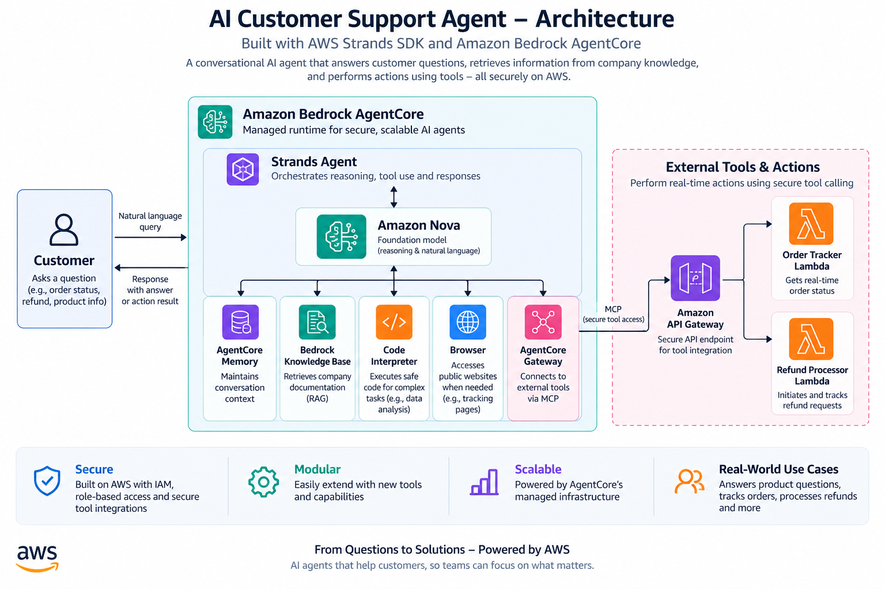

# Agentic AI Customer Support

An agentic customer support system built with **Amazon Bedrock AgentCore** and the **Strands Agents SDK**. The agent combines retrieval-augmented generation (RAG), long-term memory, tool calling, code execution, and live web interaction to handle customer support workflows beyond a traditional chatbot.

Built as part of the **AWS AI & ML Scholars program on Udacity**.

## Overview

Traditional chatbots mainly generate responses from a model's existing context. This project explores a more practical agentic architecture where the AI can decide when to retrieve information, call external services, perform calculations, remember customer preferences, or interact with a live webpage.

The agent can:

- Track customer orders using external API tools
- Initiate and check refunds
- Retrieve product, policy, and loyalty information using RAG
- Remember customer information and preferences across sessions
- Calculate loyalty discounts using isolated code execution
- Browse live webpages when current information is required

## Architecture



The **Strands Agent** acts as the orchestration layer, using Amazon Nova for reasoning while selecting specialized tools based on the customer's request. Amazon Bedrock AgentCore provides the managed runtime and supporting capabilities for memory, code execution, browser interaction, and external tool connectivity.

## Key Capabilities

### Tool Calling with MCP

The agent connects to an **Amazon Bedrock AgentCore Gateway** using the **Model Context Protocol (MCP)**.

Rather than asking the language model to invent operational information, Gateway tools allow the agent to interact with backend services.

Implemented workflows include:

- Retrieve an order
- Retrieve customer information
- Retrieve a customer's orders
- Initiate a refund
- Check refund status
- Generate a return label

The order workflow uses **Amazon API Gateway and AWS Lambda**, while refund operations are exposed through a Lambda-backed Gateway integration.

### Retrieval-Augmented Generation (RAG)

Product information, return policies, and loyalty-program information are stored in an **Amazon Bedrock Knowledge Base**.

A custom `search_knowledge_base` tool calls the Bedrock Retrieve API and supplies relevant document chunks to the agent.

This allows product and policy responses to be grounded in the provided knowledge source rather than relying only on the model's pretrained knowledge.

### Long-Term Customer Memory

**AgentCore Memory** allows useful customer context to persist between independent conversations.

The implementation stores and retrieves:

- Customer facts
- Communication preferences

A custom Strands hook retrieves relevant memories before an invocation and adds them to the agent's context. After an interaction, the completed conversation can be stored so useful information is available in future sessions.

For example, a customer can introduce themselves and request concise responses in one session, then start a new session where the agent recalls both pieces of information.

### Deterministic Business Calculations

Loyalty calculations are delegated to **AgentCore Code Interpreter** instead of relying on the language model to perform business arithmetic.

The calculation logic handles:

- Loyalty-point redemption
- Membership-tier discounts
- Maximum redemption rules
- Points earned from an order
- Remaining point balances

The Python calculation executes inside an isolated code session and returns structured results to the agent.

### Live Browser Interaction

The agent integrates **AgentCore Browser**, allowing it to navigate live webpages when information needs to be retrieved outside its static knowledge base.

This demonstrates how an agent can combine generative AI reasoning with live external interaction.

## Example Workflows

### Order Tracking

**Customer**

> Can you track order ORD-001?

The agent selects the appropriate Gateway tool and retrieves the order status, carrier, tracking number, and estimated delivery information.

### Refund Processing

**Customer**

> I want to return my Kindle Paperwhite (ORD-002). Please initiate a refund.

The agent invokes the refund workflow and returns a generated refund ID, approval status, and processing timeline.

### Knowledge Retrieval

**Customer**

> What are the benefits of the Platinum loyalty tier?

The agent retrieves the relevant loyalty-program information from the Bedrock Knowledge Base using RAG.

### Cross-Session Memory

In one session, a customer tells the agent:

> Hi, I am Jane. I prefer concise responses.

In a separate session, the agent can retrieve the stored customer context and recall both the customer's name and communication preference.

### Loyalty Calculation

**Customer**

> I am a Gold member with 4250 points. Calculate my discount on a $150 standard order.

The agent delegates the business calculation to Code Interpreter and returns structured information about point redemption, membership discount, final total, and remaining points.

### Browser Interaction

**Customer**

> Go to https://www.udacity.com and tell me the page title.

The agent uses its browser capability to access the live webpage and retrieve its current title.

## Technology Stack

| Technology                       | Purpose                                  |
| -------------------------------- | ---------------------------------------- |
| Amazon Bedrock AgentCore Runtime | Agent deployment and execution           |
| Strands Agents SDK               | Agent orchestration and tool integration |
| Amazon Nova                      | Foundation model                         |
| AgentCore Gateway                | External tool integration                |
| Model Context Protocol (MCP)     | Tool discovery and invocation            |
| AWS Lambda                       | Order and refund backend functions       |
| Amazon API Gateway               | Order-service REST endpoints             |
| Amazon Bedrock Knowledge Bases   | Retrieval-Augmented Generation           |
| Amazon S3                        | Knowledge-base document storage          |
| Amazon OpenSearch Serverless     | Vector storage                           |
| AgentCore Memory                 | Cross-session customer memory            |
| AgentCore Code Interpreter       | Deterministic calculations               |
| AgentCore Browser                | Live web interaction                     |
| Amazon CloudWatch                | Runtime logging and troubleshooting      |
| Python                           | Agent and tool implementation            |

## Project Structure

```text
.
├── images/
│   └── architecture.png
├── lambda/
│   ├── lambda_schema
│   ├── order_tracker.py
│   └── refund_processor.py
├── main.py
├── product_catalog.txt
├── pyproject.toml
├── uv.lock
└── README.md
```

### `main.py`

Contains the primary agent implementation, including:

- AgentCore application entrypoint
- Strands agent configuration
- MCP Gateway connection and tool loading
- Knowledge Base retrieval tool
- Long-term memory hooks
- Loyalty calculation tool
- Code Interpreter integration
- Browser integration
- System instructions and response handling

### `lambda/`

Contains the backend functions and schema used by the customer-support tools for order and refund workflows.

### `product_catalog.txt`

Provides the product, policy, and loyalty information used by the Bedrock Knowledge Base for RAG.

## What I Learned

The biggest takeaway from this project was understanding that building an AI agent involves much more than connecting an LLM to a prompt.

Different responsibilities are better handled by different components:

- **LLMs** handle reasoning and orchestration
- **APIs and Lambda functions** perform operational actions
- **RAG** provides grounded domain knowledge
- **Memory** maintains useful context across sessions
- **Code Interpreter** handles deterministic calculations
- **Browser tools** provide access to live information

One of the most valuable parts of the project was troubleshooting the Browser integration after deployment.

Resolving runtime and authorization problems required working through **CloudWatch logs, IAM permissions, deployed runtime behaviour, and isolated browser testing** rather than only modifying application code.

That experience reinforced the importance of observability and systematic troubleshooting when moving an AI application from local development into a cloud runtime.

## Production Considerations

A production implementation would require additional controls around authentication, authorization, observability, and customer-impacting actions.

Examples include:

- Authenticate customers before exposing order or memory data
- Require validation or confirmation before sensitive actions such as refunds
- Apply least-privilege IAM policies to agent tools
- Add structured monitoring and alerting for tool failures
- Implement stronger error handling and retry strategies
- Add audit logging for customer-impacting actions
- Protect customer memory with appropriate retention and access policies

These controls become increasingly important as AI agents move from simply answering questions to taking actions on behalf of users.

## AWS AI & ML Scholars

This project was completed as part of the **AWS AI & ML Scholars program on Udacity**.

Through the project, I gained hands-on experience building, integrating, deploying, testing, and troubleshooting an agentic AI application using AWS services and the Strands Agents SDK.

The project also reinforced a broader lesson: effective AI systems are not just models. They are systems that combine **reasoning, data, memory, tools, permissions, APIs, observability, and cloud infrastructure** to accomplish useful tasks.
